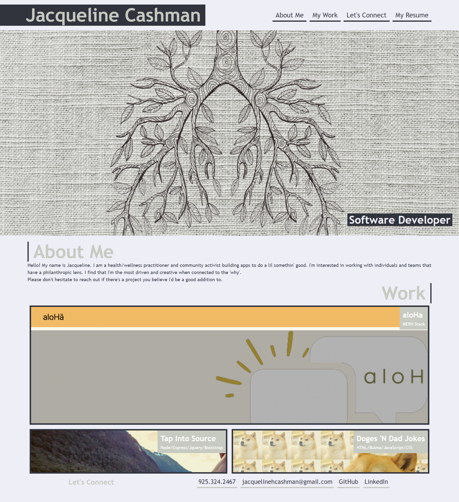

# css-portfolio

# Description

This web application is a simple css portfolio so that as an employer, they can review samples of my work and assess whether I'm a good candidate for an open position. 

An employer is presented with a responsive layout that allows them to easily navigate to my bio, applications, and contact information. 

## Table of Contents 
* [Technologies Used](#technologies-used)
* [Screenshots](#screenshots)
* [Links](#links)
* [Contributors](#contributors)

## Technologies Used

- HTML
- CSS

## Screenshots

## Links

GitHub repository URL: 
https://github.com/JacquelineHockin/css-portfolio

## Contributors 
- Jacqueline Cashman
- [GitHub: JacquelineHockin](https://github.com/jacquelinehockin)